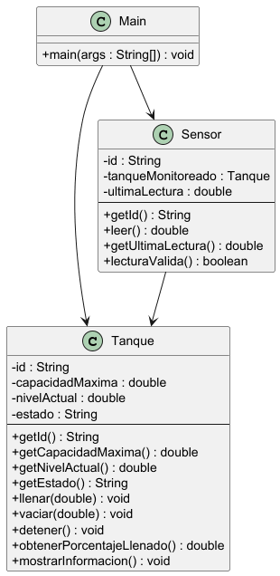

| Rol | Integrante | Usuario de GitHub | Fecha de inicio                |
| :--- | :--- | :--- |:-------------------------------|
| Estudiante A | Alejandro Spindola | alespyba1 | Jueves 7 de septiembre de 2026 |
| Estudiante B | Ricardo René Reséndiz Nieves | rresendiz42-scar | Jueves 7 de septiembre de 2026 |

---

## 1. Descripción del problema

### Qué sistema se pretende representar
El programa busca representar un sistema de tanques de almacenamiento de liquidos. Cada tanque funciona por su cuenta tiene su propia capacidad, su propio contenido y su propia condición de operación, cada tanque tiene sensor que permite conocer el nivel de líquido que contiene.

### Qué información necesita manejar
Número de tanque, Capacidad, Nivel actual, Estado de operación. Identificación del sensor. 

### Qué operaciones debe realizar

consultar la información de un tanque

llenar un tanque

vaciar un tanque

detener su operación

consultar su nivel

consultar su porcntaje de llenado

consultar su estado

obtener una lectura mediante un sensor de nivel

Estas son las operaciones, necesarias que se requieren para el correcto funcionamiento del sistema,
logrando que se lleva de forma correcta la práctica,

### Qué restricciones deben respetarse

La principal restricción es que no puede tener nivel negativo, esto por 
obvias razones, asi como tampoco podrá superar la capacidad del tanque.

## 2. Identificación de objetos

De la descripción del problema se desprenden dos elementos con identidad propia, y un tercer componente que cumple una función distinta dentro del programa.

### Tanque

**Qué representa.** Un tanque físico de almacenamiento, con su capacidad, su contenido y su condición de operación.

**Por qué debe existir como objeto.** Por que al ser 3 tanques diferentes, estos tienen sus propias datos, y
estos son ajenos a entre tanques

**Qué responsabilidad tendría.** Sería el que se encargue practicamente de la medición y almacenamiento
de los datos en cada tanque(objeto), así nos aseguramos un mejor monitoreo.

### Sensor

**Qué representa.** El sensor que va instalado en el tanque y sirve para saber cuánto líquido tiene.

**Por qué debe existir como objeto.** Es el que se encarga de detectar si el tanque
ya llego a su limite, o no.

**Qué responsabilidad tendría.** Leer el nivel del tanque que le toca, guardar esa lectura y decir si el valor es válido o no.

Lo que el sensor no hace es guardar el nivel real ni cambiarlo. Ese dato es del tanque.

---

## 3. Estado y comportamiento

| Objeto propuesto | Responsabilidad                                                                 | Información que debe conservar | Comportamientos que debe realizar                                                                                                                |
| --- |---------------------------------------------------------------------------------| --- |--------------------------------------------------------------------------------------------------------------------------------------------------|
| Tanque | Representar un tanque de almacenamiento y medir su nivel y estado de operación. | Identificador, capacidad máxima, nivel actual y estado de operación. | Poder consultar su información, llenar el tanque, vaciarlo, detener su operación, consultar el nivel, obtener el porcentaje de llenado y conocer su estado. |
| Sensor de nivel | Obtener la lectura del nivel de líquido en un tanque.                           | Tanque al que está asociado y la lectura obtenida. | Obtener una lectura del nivel actual del tanque y proporcionar dicha lectura.                                                                    |

---

## 4. Relaciones entre los objetos

El sensor de nivel necesita relacionarse con un tanque, debido a que su función depende de conocer el nivel actual del tanque que está monitoreando.

La relación será entre el Sensor y el Tanque, el sensor estará asociado a un tanque y podrá obtener información sobre su nivel actual para realizar la lectura correspondiente.

El tanque será responsable de conservar y modificar su propio nivel, mientras que el sensor será responsable únicamente de obtener la lectura.

El tanque no debe encargarse del funcionamiento del sensor y el sensor no debe modificar directamente el nivel del tanque. Cada objeto debe encargarse de se función unicamente

---

## 5. Diseño de clases

## 5. Diseño de clases

## 5. Diseño de clases

## 5. Diseño de clases

| Clase | Atributos propuestos | Tipo de dato | Métodos propuestos | Responsabilidad |
| --- | --- | --- | --- | --- |
| Tanque | Número de tanque | String | Mostrar información | Junta todos los datos del tanque y los imprime en pantalla |
| | Capacidad máxima | double | Llenar tanque | Le suma litros al contenido, sin pasarse de la capacidad |
| | Nivel actual | double | Vaciar tanque | Le resta litros al contenido, sin bajar de cero |
| | Estado de operación | String | Detener operación | Para el llenado o vaciado y pone el estado en detenido |
| | | | Consultar nivel | Dice cuántos litros hay guardados en ese momento |
| | | | Consultar porcentaje | Saca qué tan lleno está comparando el nivel con la capacidad |
| | | | Consultar estado | Dice si está detenido, llenando o vaciando |
| Sensor | ID del sensor | String | Consultar ID | Dice cómo se llama el sensor |
| | Tanque que monitorea | Tanque | Hacer lectura | Va al tanque asignado, toma su nivel y se lo queda como medición |
| | Última lectura | double | Consultar lectura | Dice cuánto marcó la última vez que midió |
| | | | Validar lectura | Revisa si lo que midió cae dentro de lo que ese tanque puede tener |

###  Qué atributos deben ser privados

Todos los de **Tanque** y **Sensor** van a ser **private**. Si **nivel** fuera público, desde cualquier lado se le podría poner un número negativo o más grande que la capacidad y se rompería la regla.

###  Qué recibe cada constructor

**Tanque** recibe el id(Número de tanque), la capacidad máxima y el nivel inicial. Sin esos tres no puede funcionar bien. El estado no se le pasa porque siempre empieza en **DETENIDO** y eso lo pone el constructor solo.

**Sensor** recibe su id y el tanque que va a medir. Un sensor sin tanque no serviría de nada.

###  Qué se puede consultar desde otras clases

Desde **Main** se puede ver el id, la capacidad, el nivel, el porcentaje y el estado del tanque, porque se necesitan para imprimirlos. Del sensor se puede ver su id y su última lectura.

###  Qué no se puede modificar desde afuera

No se puede asignar el nivel ni el estado directamente. Tampoco la capacidad máxima, porque el tanque no cambia de tamaño mientras opera. Y la lectura del sensor tampoco, porque tiene que salir de medir.

## 6. Diagrama UML

---
## 7. Justificación del diseño

### ¿Por qué propusimos esas clases?

Buscamos qué cosas del problema tienen sus propios datos y hacen algo con esos datos. El tanque los tiene: capacidad, nivel y estado, y además se llena, se vacía y se detiene. El sensor igual: tiene su id, guarda su lectura y mide. Por eso quedaron esas dos.

### ¿Cuál es la responsabilidad principal de cada clase?

**Tanque** guarda sus datos y cuida que el nivel no se salga de los límites. Como es el único que puede cambiar el nivel,.

**Sensor** Le pregunta el nivel al tanque, y guarda ese valor como su última lectura y dice si es válido.

### ¿Por qué determinados atributos fueron definidos como privados?

Si el nivel fuera público, se le podría poner un número negativo o más grande que la capacidad y nada lo impediría. Estando privado, la única forma de cambiarlo es con **llenar()** o **vaciar()**, que sí revisan los límites antes, con los demás es igual.

### ¿Qué información decidimos proporcionar mediante los constructores?

Nada más lo que el objeto necesita para poder existir bien.

Al tanque le pasamos su id, su capacidad máxima y cuánto trae al empezar. El estado no, porque siempre empieza detenido y eso lo pone el constructor solo.

Al sensor le pasamos su id y el tanque que va a medir. La lectura no, porque esa sale de medir.

### ¿Qué objetos se relacionan entre sí y por qué?

El sensor con el tanque. El sensor guarda la referencia que tiene el tanque, pero el tanque no guarda ninguna del sensor.

El sensor no puede medir si no sabe a quién, pero el tanque hace todo su trabajo sin importar si tiene sensor puesto o no.

### ¿Qué decisiones tomamos para evitar duplicar responsabilidades?

Que el sensor no guarde el nivel del tanque. Si lo guardara, el mismo dato estaría en dos lados y si se nos olvida actualizarlo.

Que el porcentaje lo calcule el tanque, porque sale del nivel y la capacidad, y los dos son datos suyos.

### ¿Qué parte del diseño fue discutida entre ambos integrantes y qué decisión tomamos?

Lo que más discutimos fue cómo conectar el sensor con el tanque.

La primera idea era que el sensor tuviera su propio nivel guardado y que desde **Main** lo fuéramos actualizando. Se veía más fácil, pero nos dimos cuenta de que nos obligaba a acordarnos de actualizarlo cada vez, y si se nos pasaba una vez el sensor daría lecturas falsas sin avisar.

Al final quedamos en que el sensor guarde la referencia al tanque y que al leer le pregunte el nivel en ese momento. Así siempre coincide.

Lo otro que discutimos fue qué hacer si alguien quiere llenar de más, Escogimos llenarlo